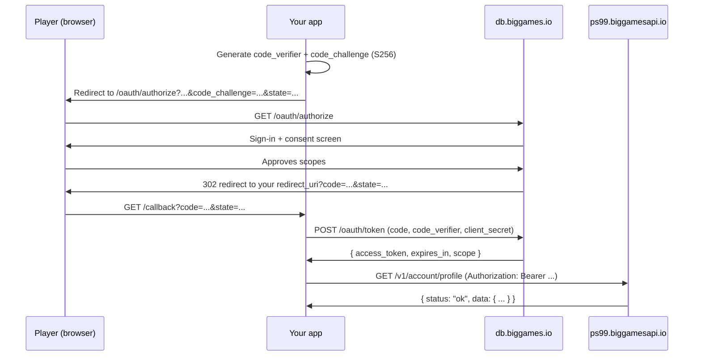

# Authentication

## TL;DR

Register a developer app at the [developer dashboard](https://db.biggames.io/settings/developer-apps) to get your credentials. Redirect the player to `/oauth/authorize`, then exchange the returned one-time code at `/oauth/token` to receive an access token. Send that token as `Authorization: Bearer <token>` on every `/v1/account/*` request.

## Register a developer app

Create an app at [https://db.biggames.io/settings/developer-apps](https://db.biggames.io/settings/developer-apps).

You will provide:

- **App name** — displayed to players on the consent screen so they know which app is asking for access.
- **Redirect URI(s)** — the URL(s) the dashboard is allowed to send the player back to after they approve or deny access. The redirect URI must be an exact match (scheme, host, path, and port) — no wildcards. You can register more than one.
- **Scopes** — the list of permissions your app needs (see [Scopes](#scopes) below). You can only request scopes that are registered against your app.

You will receive:

- **`client_id`** — a public identifier for your app. Safe to include in URLs, logs, and client-side code.
- **`client_secret`** — a private secret used to prove your app's identity when exchanging authorization codes for tokens. Never expose this in a browser, a mobile app, source control, or any other public surface — treat it like a password. If it leaks, rotate it immediately from the developer dashboard.

Only scopes registered against your app can be requested in `/oauth/authorize`. Attempting to request an unregistered scope will be rejected before the player ever sees the consent screen.

## Scopes

A **scope** is a named permission. When your app requests a scope, the player sees it on the consent screen and decides whether to approve it. If they approve, the resulting access token is allowed to call the corresponding endpoint. If they do not approve a scope, calls to that endpoint will return a 403 error.

Each scope follows the format `player-data:<universe>:<view>:read`. For this API the universe is always `pet-simulator-99`, and the view corresponds to one `/v1/account/*` endpoint. All scopes are read-only.

| Scope | Endpoint unlocked | What the player approves |
| --- | --- | --- |
| `player-data:pet-simulator-99:inventory:read` | `GET /v1/account/inventory` | View your inventory and equipped loadout. |
| `player-data:pet-simulator-99:profile:read` | `GET /v1/account/profile` | View your profile — progression, currencies, statistics, mastery, achievements, and zones. |
| `player-data:pet-simulator-99:extendedProfile:read` | `GET /v1/account/extendedProfile` | View sensitive account stats — gamepasses, product purchases, and Robux spent. |
| `player-data:pet-simulator-99:itemIndex:read` | `GET /v1/account/itemIndex` | View your full item collection index. |
| `player-data:pet-simulator-99:trades:read` | `GET /v1/account/trades` | View your trade history. |
| `player-data:pet-simulator-99:booth:read` | `GET /v1/account/booth` | View your booth transaction history. |
| `player-data:pet-simulator-99:mail:read` | `GET /v1/account/mail` | View your in-game mail and gift records. |

Request only the scopes your app actually uses. Asking for more permissions than needed makes the consent screen more intimidating and reduces the likelihood that players will approve your app.

## The flow (Authorization Code + PKCE)

This is standard **OAuth 2.0 Authorization Code** flow with **PKCE** (Proof Key for Code Exchange), as defined in [RFC 6749](https://datatracker.ietf.org/doc/html/rfc6749) and [RFC 7636](https://datatracker.ietf.org/doc/html/rfc7636), using the S256 challenge method.

If you have never seen OAuth before: the core idea is that your app never handles the player's password. Instead, the player logs in directly on the BIG Games dashboard and approves a list of permissions. The dashboard then gives your app a short-lived code that you exchange (server-side) for an access token. The access token is what you actually use to call the API.

PKCE (pronounced "pixie") adds a second layer of protection on top of this. Before the flow starts, your server generates a random secret (the `code_verifier`) and a hash of it (the `code_challenge`). The challenge is sent up front; the verifier is only revealed during the token exchange. This means that even if an attacker intercepts the authorization code, they cannot use it without also knowing the verifier.



### Step 1 — Generate `code_verifier` and `code_challenge`

The **`code_verifier`** is a random URL-safe string, between 43 and 128 characters long, that only your server ever sees. The **`code_challenge`** is a one-way hash of the verifier: `BASE64URL(SHA256(code_verifier))` with any trailing `=` padding stripped. You send the challenge now and keep the verifier secret until step 5.

```python
import secrets, hashlib, base64

code_verifier = secrets.token_urlsafe(64)[:128]
code_challenge = base64.urlsafe_b64encode(
    hashlib.sha256(code_verifier.encode()).digest()
).rstrip(b'=').decode()
```

Store `code_verifier` server-side, keyed to the `state` value you will generate in step 2. You will need it in step 5.

> Both `code_verifier` and `state` must be stored on your server, not in the browser. Storing them in a cookie or in-memory session (keyed to the session ID) works well.

### Step 2 — Redirect the player

Send the player's browser to `/oauth/authorize` with the following query parameters:

```http
https://db.biggames.io/oauth/authorize
  ?client_id=YOUR_CLIENT_ID
  &redirect_uri=https://yourapp.example/callback
  &scope=player-data:pet-simulator-99:profile:read+player-data:pet-simulator-99:inventory:read
  &code_challenge=<challenge>
  &code_challenge_method=S256
  &state=<random>
```

Parameter notes:

- **`client_id`** — the ID you received when you registered your app.
- **`redirect_uri`** — must exactly match one of the URIs registered in the developer dashboard.
- **`scope`** — a space-separated list of scopes from the table above. URL-encode spaces as `+` or `%20`.
- **`code_challenge`** — the hashed verifier from step 1.
- **`code_challenge_method`** — must be exactly `S256`. Any other value, or omitting this parameter, will cause the authorize endpoint to reject the request with `PKCE code challenge is required.` before the player sees anything.
- **`state`** — a random, per-session value you generate on your server. It must be unpredictable. You will verify it in step 4 to prove the callback is genuine and not forged by a third party.

### Step 3 — Consent

The dashboard signs the player in if they are not already logged in. It then shows a consent screen listing every scope your app requested, along with the player-facing descriptions from the scopes table. If the player has already approved some of those scopes in a previous session, the consent screen highlights only the new ones.

The player selects which linked Roblox account to associate with this authorization and clicks Approve. If they click Deny, the dashboard redirects to your `redirect_uri` with `?error=access_denied&state=...` instead of a code.

### Step 4 — Receive the callback

After the player approves, the dashboard issues a 302 redirect to your `redirect_uri` with `?code=...&state=...` appended. The **`code`** is a short-lived, single-use authorization code. Authorization codes expire after 5 minutes and can only be redeemed once.

**Before doing anything else, verify that `state` matches what you sent in step 2.** If it does not match, discard the request immediately and do not exchange the code. A mismatched `state` is a sign of a cross-site request forgery (CSRF) or replay attack — an attacker attempting to trick your server into attaching their authorization to your user's session.

### Step 5 — Exchange the code for a token

POST to `https://db.biggames.io/oauth/token` with an `application/x-www-form-urlencoded` body. Send your credentials using **HTTP Basic authentication**: the `Authorization` header contains `Basic ` followed by Base64-encoded `client_id:client_secret`.

```python
import requests, base64

basic = base64.b64encode(f"{client_id}:{client_secret}".encode()).decode()
resp = requests.post(
    "https://db.biggames.io/oauth/token",
    data={
        "grant_type": "authorization_code",
        "code": code,
        "redirect_uri": redirect_uri,
        "code_verifier": code_verifier,
    },
    headers={"Authorization": f"Basic {basic}"},
)
token = resp.json()["access_token"]
```

The endpoint checks all of the following before issuing a token:

- `grant_type` is `authorization_code`
- `client_id` and `client_secret` match a registered, active app
- `code` was issued for that `client_id` and has not expired or been redeemed before
- `redirect_uri` exactly matches the one used in step 2
- `code_verifier`, when hashed with SHA-256, matches the `code_challenge` stored against the code

If all checks pass, the response is:

```json
{
  "access_token": "...",
  "token_type": "Bearer",
  "expires_in": 2592000,
  "scope": "player-data:pet-simulator-99:profile:read player-data:pet-simulator-99:inventory:read"
}
```

`expires_in` is in seconds. `2592000` = 30 days. Store the `access_token` securely on your server — do not expose it to the browser.

### Step 6 — Call the API

Include the access token as a **Bearer token** in the `Authorization` header on every `/v1/account/*` request. The word "Bearer" is part of the HTTP standard (RFC 6750) and means "the holder of this token is authorized."

```
Authorization: Bearer <access_token>
```

Full example:

```
GET /v1/account/profile HTTP/1.1
Host: ps99.biggamesapi.io
Authorization: Bearer <access_token>
```

The API will return a 401 if the token is missing, a 403 if the token does not have the required scope for the endpoint, and a 429 if you are rate-limited.

## Token lifecycle

- Access tokens are valid for **30 days** from the moment of issuance (`expires_in: 2592000` seconds).
- **There is no refresh-token endpoint today.** When a token expires the player must repeat the full authorization flow to issue a new one. Build your app to detect 401 responses and prompt the player to re-authorize.
- Players can revoke a token at any time from their account dashboard under Connected apps. After revocation the token will immediately return 401 on all API calls.
- Developers can revoke all tokens issued to their app from the [developer apps dashboard](https://db.biggames.io/settings/developer-apps). This is useful if you believe your app has been compromised.
- When you rotate `client_secret`, **existing access tokens remain valid** until they expire naturally — only new token issuance requires the new secret. Rotating the secret does not log players out or interrupt active API sessions.

## Security notes

- **Keep `client_secret` server-side only.** Never expose it in browser JavaScript, a mobile app binary, a public Git repository, or any other client-accessible surface. If it leaks, an attacker can impersonate your app and exchange valid authorization codes for tokens. Today's `/oauth/token` requires `client_secret`, making confidential server-side clients the only supported pattern. Public-client support (PKCE-only, no `client_secret`) may be added in a future release — check the changelog.
- **Always verify `state`.** Check it before you exchange the code. A forged callback with a valid code but a wrong `state` is a CSRF or replay attack (see step 4).
- **Validate scopes on incoming tokens.** Never assume a token has scopes you did not explicitly request. The `scope` field in the token response is the authoritative list. If your app logic branches on whether a scope is present, read it from the token response rather than assuming.
- **Rotate `client_secret` immediately if you suspect a leak.** Go to the developer dashboard, rotate the secret, and deploy the new value. Existing tokens will continue to work until they expire; no player action is needed. However any attacker holding the old secret will no longer be able to issue new tokens.
- **Do not log access tokens.** Treat them with the same care as passwords. If they appear in logs, rotate by revoking the app from the developer dashboard and having affected players re-authorize.

## Errors during auth

| Where | Error message | Likely cause |
| --- | --- | --- |
| `/oauth/authorize` | `Unknown client.` | `client_id` is not registered or was typed incorrectly. |
| `/oauth/authorize` | `PKCE code challenge is required.` | `code_challenge_method` is not `S256`, or `code_challenge` is missing from the query string. |
| `/oauth/token` | `Unsupported grant_type.` | `grant_type` in the POST body is not `authorization_code`. |
| `/oauth/token` | `Malformed request body.` | The POST body could not be parsed as `application/x-www-form-urlencoded`. Check that you are not accidentally sending JSON or a blank body. |
| `/oauth/token` | `Missing token exchange parameters.` | One or more of `client_id`, `client_secret`, `code`, `redirect_uri`, or `code_verifier` is empty or absent. |
| `/oauth/token` | `Invalid client credentials.` | `client_secret` is wrong, the app does not exist, or the app has been revoked. |
| `/oauth/token` | `invalid_grant` | The authorization code expired (codes are valid for 5 minutes), was already redeemed, `redirect_uri` does not exactly match what was sent to `/oauth/authorize`, or `code_verifier` does not hash to the stored `code_challenge`. All of these return the **same** generic `invalid_grant` response — the specific reason is never disclosed. |

**Error body shapes.** `/oauth/token` failures return JSON. The pre-grant validation errors above (`Unsupported grant_type.`, `Malformed request body.`, `Missing token exchange parameters.`, `Invalid client credentials.`) use the shape `{ "error": "<message>" }` — HTTP `400` for malformed requests, HTTP `401` for `Invalid client credentials.`. The grant-exchange failure uses the OAuth-standard shape `{ "error": "invalid_grant", "error_description": "The authorization grant is invalid, expired, or has already been used." }` at HTTP `400`.

Resource-server errors (the `401`/`403`/`429` returned from `/v1/account/*` calls) use a **different** envelope — `{ "status": "error", "error": { "message": "...", "ignore": true } }` — documented in [v1/account.md](account.md#common-error-responses).
